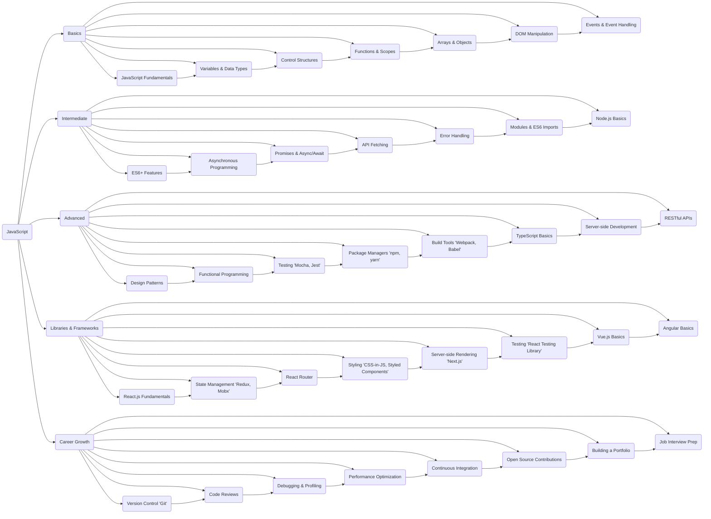

```mermaid

flowchart LR

A0(JavaScript)

A0 -->A1(Basics)
A0 -->B1(Intermediate) 
A0 -->C1(Advanced) 
A0 -->D1(Libraries & Frameworks) 
A0 -->E1(Career Growth)

A1 -->A(JavaScript Fundamentals)
A1 -->B(Variables & Data Types)
A1 -->C(Control Structures) 
A1 -->D(Functions & Scopes) 
A1 -->E(Arrays & Objects) 
A1 -->F(DOM Manipulation) 
A1 -->G(Events & Event Handling) 

B1 -->H(ES6+ Features)
B1 -->I(Asynchronous Programming)
B1 -->J(Promises & Async/Await) 
B1 -->K(API Fetching) 
B1 -->L(Error Handling) 
B1 -->M(Modules & ES6 Imports) 
B1 -->N(Node.js Basics) 

C1 -->O(Design Patterns) 
C1 -->P(Functional Programming) 
C1 -->Q(Testing 'Mocha, Jest') 
C1 -->R(Package Managers 'npm, yarn') 
C1 -->S(Build Tools 'Webpack, Babel') 
C1 -->T(TypeScript Basics) 
C1 -->U(Server-side Development) 
C1 -->V(RESTful APIs) 

D1 -->W(React.js Fundamentals) 
D1 -->X(State Management 'Redux, Mobx') 
D1 -->Y(React Router) 
D1 -->Z(Styling 'CSS-in-JS, Styled Components') 
D1 -->AA(Server-side Rendering 'Next.js') 
D1 -->AB(Testing 'React Testing Library') 
D1 -->AC(Vue.js Basics) 
D1 -->AD(Angular Basics) 

E1 -->AE(Version Control 'Git') 
E1 -->AF(Code Reviews) 
E1 -->AG(Debugging & Profiling) 
E1 -->AH(Performance Optimization) 
E1 -->AI(Continuous Integration) 
E1 -->AJ(Open Source Contributions) 
E1 -->AK(Building a Portfolio) 
E1 -->AL(Job Interview Prep) 


A --> B
B --> C
C --> D
D --> E
E --> F
F --> G

H --> I
I --> J
J --> K
K --> L
L --> M
M --> N

O --> P
P --> Q
Q --> R
R --> S
S --> T
T --> U
U --> V

W --> X
X --> Y
Y --> Z
Z --> AA
AA --> AB
AB --> AC
AC --> AD

AE --> AF
AF --> AG
AG --> AH
AH --> AI
AI --> AJ
AJ --> AK
AK --> AL

```

